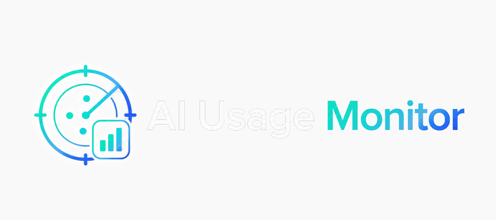
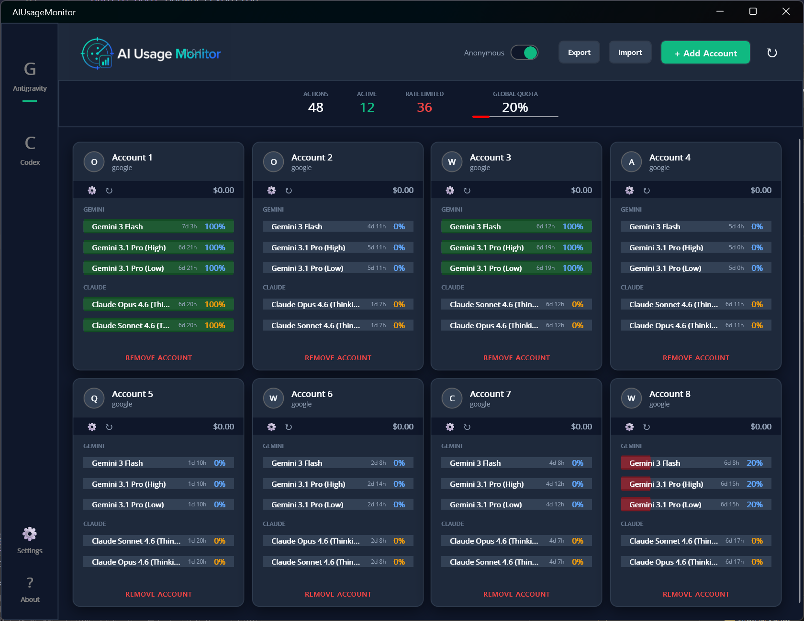
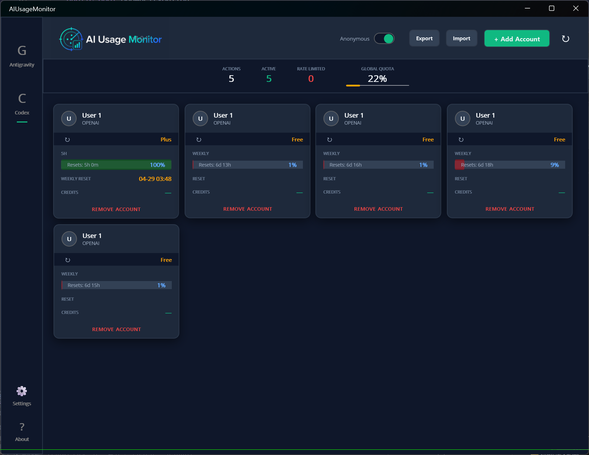

# AIUsageMonitor

> Antigravity, Codex, Cursor 사용량을 한 화면에서 확인하는 Windows 중심 AI 사용량 모니터링 앱

## 개요

AIUsageMonitor는 여러 AI 계정의 사용량, 제한 상태, 리셋 시점을 한 곳에서 확인할 수 있는 .NET MAUI 데스크톱 앱입니다. 현재는 Windows 데스크톱 환경에 맞춰 최적화되어 있습니다.

## 미리보기

| Antigravity (Google) | Codex (OpenAI/GitHub) |
| :---: | :---: |
|  |  |

## 다운로드

최신 빌드는 Releases 페이지에서 받을 수 있습니다.

## 주요 기능

### 멀티 서비스 지원
- Antigravity 계정 및 모델 사용량 추적
- Codex 세션 제한과 주간 제한 모니터링
- Cursor 로컬 DB 기반 Composer context 사용량 모니터링
- 여러 계정을 한 대시보드에서 통합 관리

### Windows tray 워크플로우
- 트레이 아이콘 표시
- 좌클릭과 더블클릭으로 창 복원
- 닫기 시 트레이로 보내기 / 종료 선택
- 닫기 동작 기억하기

### 새로고침과 모니터링
- 헤더에서 전체 새로고침
- 현재 탭 기준 `F5` 전체 새로고침
- 제한된 동시성 기반 백그라운드 refresh queue
- 네트워크 오류를 고려한 재시도 흐름

### 프라이버시와 사용성
- 화면 공유용 Anonymous 모드
- Antigravity 모델 목록 수동 관리
- Cursor 계정 카드 이름 변경 지원
- Antigravity / Codex / Cursor / Settings / About 탭 구성

## Antigravity 모델 목록

- 앱 시작 시 기본 모델 목록과 순서를 사용합니다.
- `Gemini 3.1 Pro (High)`
- `Gemini 3.1 Pro (Low)`
- `Gemini 3 Flash`
- `Claude Sonnet 4.6 (Thinking)`
- `Claude Opus 4.6 (Thinking)`
- `GPT-OSS 120B (Medium)`
- `Update Model List`는 이미 받아온 Antigravity quota 데이터 기준으로 모델을 추가합니다.
- 새로 발견된 모델은 기본적으로 `OFF` 상태로만 추가됩니다.
- `Set to Default`는 기본 모델 목록으로 되돌립니다.
- 현재 데이터에 없는 항목은 삭제하지 않고 Settings에서 `Missing`으로 표시합니다.

## Cursor 모니터링

- Cursor 탭은 `%APPDATA%\Cursor\User\globalStorage\state.vscdb` 로컬 DB를 읽습니다.
- Cursor가 설치되어 있지 않거나 로그인되어 있지 않으면 설치/로그인 안내와 `https://cursor.com/` 열기 버튼을 표시합니다.
- `Add Current Account`를 누르면 현재 Cursor에 로그인된 로컬 세션을 가져옵니다.
- Cursor ID/PW 입력은 필요하지 않습니다.
- Cursor 카드는 Composer context 사용률, 남은 context, reset date, 바닥 도달 상태를 보여줍니다.
- 같은 reset window 안에서는 가장 높았던 context 사용률을 유지해, reset 전인데 사용량이 회복된 것처럼 보이는 상황을 줄입니다.
- Cursor 세션에서 이메일이나 닉네임을 안정적으로 얻기 어려워 카드 이름은 직접 바꿀 수 있습니다.

## 요구 사항

- .NET 10.0 SDK
- .NET MAUI workload가 포함된 Visual Studio
- Windows 10/11

## 소스에서 실행

1. 저장소를 클론합니다.
2. Visual Studio에서 `AIUsageMonitor.sln`을 엽니다.
3. NuGet 패키지를 복원합니다.
4. `Windows Machine` 대상으로 실행합니다.

## 인증

### Antigravity (Google)
1. Antigravity 탭을 엽니다.
2. **+ Add Account**를 누릅니다.
3. Google OAuth 흐름을 완료합니다.
4. access token과 refresh token은 플랫폼 보안 저장소를 통해 로컬에 저장됩니다.
5. refresh token이 있으면 만료 전에 백그라운드에서 갱신합니다.

### Codex (OpenAI / GitHub)
1. Codex 탭을 엽니다.
2. **+ Add Account**를 누릅니다.
3. OpenAI login, GitHub login, manual token entry 중 하나를 선택합니다.
4. 추출된 세션/토큰 정보는 로컬에 저장되며 refresh queue를 통해 quota 정보를 갱신합니다.

### Cursor
1. Cursor를 먼저 설치하고 로그인합니다.
2. Cursor 탭을 엽니다.
3. **Add Current Account**를 누릅니다.
4. 앱이 로컬 Cursor DB에서 현재 세션을 읽어 계정을 추가합니다.

## 참고

- 버전: `v1.0.6`
- Windows tray 동작은 platform controller 계층에서 관리합니다.
- tray 아이콘은 Windows 호환성을 위해 `trayicon.ico`로 배포합니다.

## 개인정보 및 보안

- 토큰과 설정은 로컬에 저장됩니다.
- 앱은 각 서비스 제공자 엔드포인트와 직접 통신합니다.
- 민감한 계정에 사용하기 전 소스를 검토하는 것을 권장합니다.

## 라이선스

MIT License를 따릅니다. 자세한 내용은 `LICENSE`를 확인해주세요.
