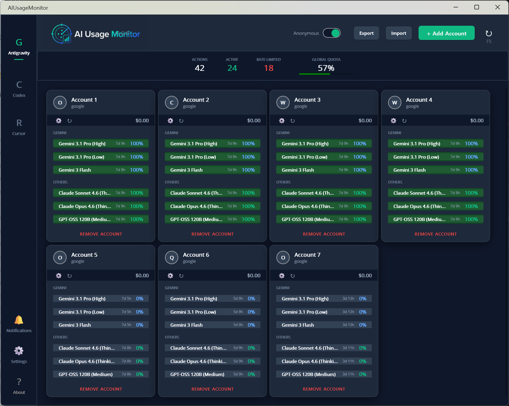
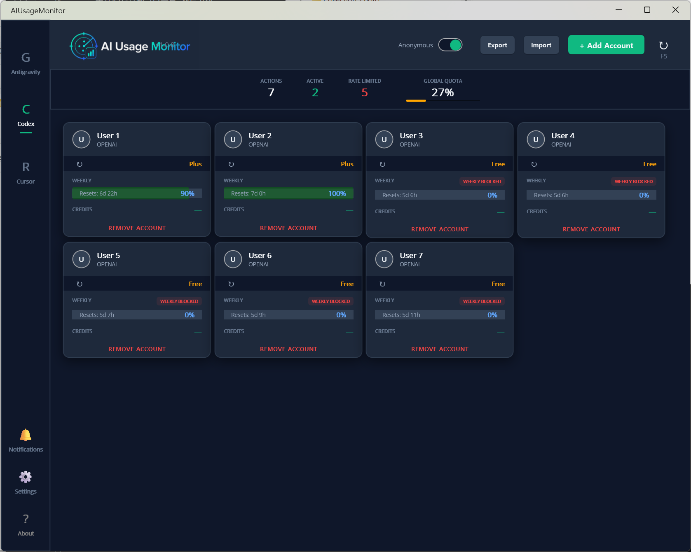

# AIUsageMonitor

> A practical quota monitor for budget-conscious solo AI developers.

Use several AI accounts,<br>
without turning account switching into another job.

Sign in and work in each provider yourself.<br>
AIUsageMonitor keeps quotas, reset windows,<br>
and account status visible in one place.

**This is a monitoring dashboard,<br>
not an automatic account switcher.**

Multi-account tools kept logging sessions out,<br>
making manual sign-in unavoidable anyway.<br>
That experience is why this project focuses on monitoring.

[한국어 README](README.kr.md) · [Developer notes](DEVELOPMENT.md)

## What It Shows

- Antigravity account and model quotas
- Codex usage limits and reset windows
- Cursor usage and local Composer context state
- Multiple accounts in one Windows dashboard
- Manual, queued, and background refresh
- Tray and optional Slack notifications
- Anonymous mode for screen sharing

## Screenshots

| Antigravity | Codex |
| :---: | :---: |
|  |  |

## Basic Workflow

1. Add the accounts you want to monitor.
2. Keep using Google, ChatGPT/Codex, and Cursor normally.
3. Refresh AIUsageMonitor when you want a single view of remaining quota and reset timing.

The app does not automate provider-side account switching.<br>
It does not replace the providers' login screens.

## Local Data

Account metadata, encrypted monitoring tokens,<br>
settings, and WebView data are kept under `userdata` beside the executable.

This is intentional.<br>
Common system profile paths are convenient,<br>
but they are also obvious places to scrape after a compromise.<br>
Keeping the app's data beside the executable makes the trust boundary visible,<br>
portable, and directly manageable by the user.

```text
AIUsageMonitor.exe
userdata/
  data/
  webview/
```

`userdata` is intentionally excluded from Git.

## Download And Build

Download a build from the Releases page,<br>
or build the Windows target with .NET 10 and the .NET MAUI workload.

```powershell
dotnet build AIUsageMonitor.csproj -f net10.0-windows10.0.19041.0 -c Release
```

Run `build-as-binary.bat` to create a compressed,<br>
self-contained single executable and a versioned release zip:

```text
build/Release_yyyyMMdd_HHmmss/
  AIUsageMonitor.exe
  AIUsageMonitor-v1.0.9-win-x64-single-file-yyyyMMdd_HHmmss.zip
```

The zip contains only `AIUsageMonitor.exe`.

## Privacy

- Local app data stays under the executable's `userdata` directory.
- `build`, `userdata`, `.git`, and `.vs` are excluded from publish inputs.
- Provider requests are made directly to the relevant provider endpoints.
- Raw Codex response logging is opt-in and intended only for Debug diagnostics.
- Review the source before using sensitive accounts.

## License

MIT License. See [LICENSE](LICENSE).
